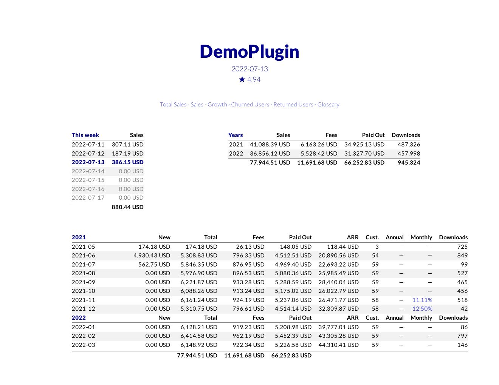

# marketplace-stats
This is a tool to create reports for paid plugins on the JetBrains marketplace.

It creates a report for one plugin at a time.

Pre—built binaries are available on the [releases page](https://github.com/jansorg/marketplace-stats/releases).

# Example
[Complete HTML of this random report](./random-report.html)

[PDF of this random report](./random-report.pdf)



# Building
First, make sure you have installed Golang 1.15.

```bash
go get github.com/jansorg/marketplace-stats
```

# Command Line Usage
```plain
Usage of ./marketplace-stats:
  -cache-file string
        The file where sales data is cached. Use -fetch to update it.
  -fetch
        The file where sales data is cached. Use -fetch to update it. (default true)
  -out string
        The file where the HTML sales report is saved. (default "report.html")
  -plugin-id string
        The ID of the plugin, e.g. 12345.
  -token string
        The token to access the API of the JetBrains marketplace. --token-file is an alternative.
  -token-file string
        Path to a file, which contains the token to access the API of the JetBrains marketplace.
```

# Generating Reports
Reports are self-contained HTML files. The file uses an optional font from Google Fonts, but everything else is in the HTML file.

To generate a report, you need the following:
- **The numeric ID of your plugin**<br>This is the number in the marketplace URL. For example, the ID of BashSupport Pro is 13841, because the URL is https://plugins.jetbrains.com/plugin/13841-bashsupport-pro.
- **An API token**<br>You can generate a token at https://plugins.jetbrains.com/author/me/tokens. `marketplace-stats` can read the token from the command line or from a file.

The following command generates `report.html` for plugin 123456. The token is retrieved from the given file.
 
```bash
# marketplace-stats is in $GOPATH/bin, e.g. $HOME/go/bin
marketplace-stats -plugin-id 123456 -token-file token.txt -out report.html 
```

## Tips & Tricks
- There's a tooltip on the numbers of the `Customers` column in the table of monthly summaries. The tooltip tells more about the changes in active customers in a month.  

# Go Client for the JetBrains Marketplace
Package `marketplace` contains a work-in-progress client for the REST API of the JetBrains marketplace. See [`main.go`](./main.go) how to use it.

# Contributing
This tool is made for my own plugins and requirements. I'm not planning to spend time to adjust it to the requirements of others. 

I'll gladly accept pull requests, if they don't break existing functionality.

# License
This software is licensed under Apache License, version 2.0.